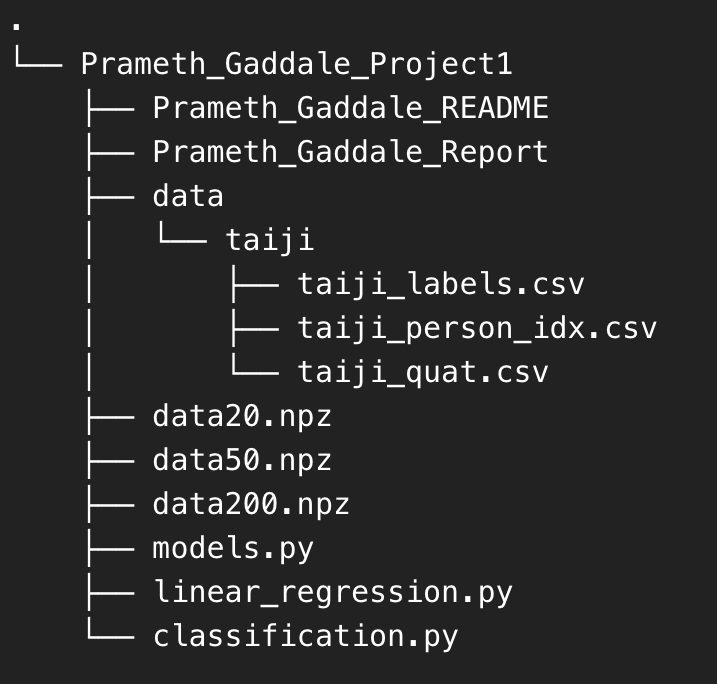

# Project 1
Name:   Prameth Gaddale
Email: pqg5273@psu.edu

## File Structure

### `models.py`
- Contains the classes for the Maximum Likelihood Estimation and Maximum A Posteriri Model.
- `ML()` class contains the functions `fit()` and `predict()`.
- `MAP()` class contains the functions `fit()` and `predict()`.

### `linear_regression.py`
- `generateNoisyData()`
- `plot_with_shadded_bar()`
- `plot_results()`
- `rmse()`
- `zero_pad_weights()`
- `linear_regression()`

### `classification.py`
- `viz_desc_bounds()`
- `load_dataset()`
- `plot_conf_mats()`
- `plot_class_mats()`
- `fisher_projection()`
- `classification()`