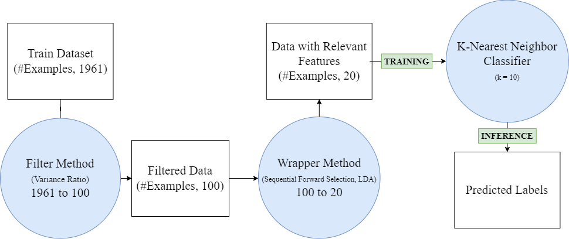

# Project 1
Name:   Prameth Gaddale
Email: pqg5273@psu.edu

## File Structure

```
.
└── Prameth_Gaddale_Project2/
    ├── data/
    │   └── data.npz
    ├── util.py
    ├── feat_select.py
    ├── classification.py
    ├── no_filter_no_wrapper/
    │   ├── plots
    │   └── stats
    ├── filter_no_wrapper/
    │   ├── plots
    │   └── stats
    ├── filter_wrapper_results/
    │   ├── plots
    │   └── stats
    ├── Prameth_Gaddale_Report.pdf
    └── Prameth_Gaddale_README.md
```

### `classification.py`
The main file for performing Classification.
- `train()`
    - Perform the feature selection, main function for the training process using filter and wrapper method.
- `visualize()`
    - Visualize the results.

### `feat_select.py`
The file contains the functions corresponding to the Feature Selection:
- `filter_method()`
    - Performs filter method with Variance Ratio as the evaluation criterion.
- `forward_selection()`
    - Performs the Wrapper Method through the use of Sequential Forward Selection Algorithm.

### `util.py`
The file contains the following functions:
- `arg_parse()`
    - Parses the arguments.
- `load_dataset()`
    - Loads the dataset.
- `normalize_data()`
    - Normalizes the data to [0, 1] range. Records the min and max values if sent training data. If sent test data, uses the previous min and max values.
- `split_data()`
    - Splits the data in a LOSO fashion with the i-th subject as test data.
- `plot_feat()`
    - Plots the features and their scores or number of times and their scores.
- `sub_stats()`
    - Calculated the subject statistics.

## Model Pipeline
